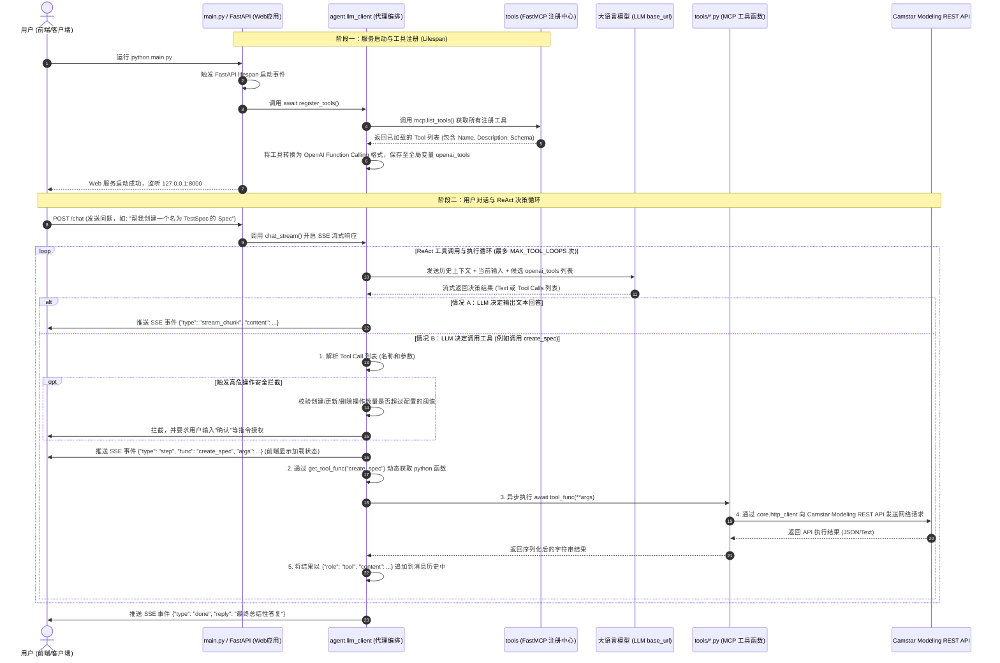

# Camstar Modeling MCP Agent 调用全过程解析

本文档详细阐述了 **Siemens Opcenter Modeling AI Agent** 从入口 `main.py` 启动，到接收用户请求、通过大语言模型 (LLM) 进行意图识别、最终调度并执行 Model Context Protocol (MCP) 工具的完整工作流与底层实现机制。

---

## 1. 核心流程时序图 (Mermaid)

下图展示了从系统启动初始化，到处理用户请求并进行 ReAct 工具调用循环的完整时序流程：



---

## 2. 核心阶段详解

### 阶段一：服务启动与工具注册 (Startup & Registration)

1. **入口启动**:
   用户在控制台运行 `python main.py`。
   * [main.py](file:///d:/Deepseek/camstar/CamstarModelingMCP/main.py) 重新配置了控制台输出编码为 UTF-8，以防止中文字符乱码。
   * 调用 `web.app.create_app()` 初始化 FastAPI 应用，并通过 `uvicorn.run` 将其部署在 `127.0.0.1:8000` 上。
2. **生命周期拦截 (Lifespan)**:
   FastAPI 在启动时，会触发定义在 [web/app.py](file:///d:/Deepseek/camstar/CamstarModelingMCP/web/app.py) 中的 `lifespan` 异步上下文管理器。
   * 首先调用 `init_memory()`：在本地内存中初始化对话历史和记忆存储。
   * 随后调用 `await register_tools()`：将 MCP 工具注册到 LLM 客户端中。
3. **在进程内收集 FastMCP 工具**:
   在 `register_tools()` 执行时：
   * 它会导入 [tools/__init__.py](file:///d:/Deepseek/camstar/CamstarModelingMCP/tools/__init__.py)。该文件内初始化了 `FastMCP("CamstarModeling")` 实例 `mcp`。
   * 导入 `tools` 包下的具体实体文件：`specs`, `operations`, `workflows`, `products`, `mfgorders`。
   * 每个实体文件（如 [tools/specs.py](file:///d:/Deepseek/camstar/CamstarModelingMCP/tools/specs.py)）中，各种操作接口都使用了 `@mcp.tool` 装饰器。例如：
     ```python
     @mcp.tool
     async def list_specs(filter_expr: Optional[str] = None, ...) -> str:
         ...
     ```
     装饰器会自动将这些 Python 异步函数注册到 `mcp` 对象内部的工具清单中。
4. **生成 OpenAI 格式 Schema**:
   * `register_tools()` 调用 `await mcp.list_tools()` 遍历所有已被装饰器捕获的工具。
   * 将每个工具的 `name` (名称)、`description` (描述) 和 `parameters` (基于 Pydantic / 类型提示推导出的 JSON Schema 结构) 包装成 OpenAI 定义的 `function` 格式。
   * 结果被保存在全局列表 `openai_tools` 中，以供后续 LLM 调用。

---

### 阶段二：用户对话与 SSE 流式响应 (SSE Chat Flow)

1. **Web 端请求传入**:
   当用户在前端界面输入提问并发送时，会向 `/chat` 接口发送 POST 请求，传输 `message` (消息内容), `username` (用户名), `session_id` (会话ID)。
2. **生成 SSE Stream 响应**:
   * [web/routes.py](file:///d:/Deepseek/camstar/CamstarModelingMCP/web/routes.py) 接受请求，调用 `chat_stream(username, message, session_id)`，并将其包装为 `StreamingResponse` 返回给浏览器。
   * 这样系统能够实现 **SSE (Server-Sent Events)**，将机器人的思考、工具调用过程以及流式文本实时推送给前端。

---

### 阶段三：Agent 决策与 ReAct 循环 (ReAct Reasoning Loop)

这一阶段是智能体 (Agent) 的核心推理逻辑，对应 [agent/llm_client.py](file:///d:/Deepseek/camstar/CamstarModelingMCP/agent/llm_client.py) 中的 `chat_stream` 循环。

1. **调用 LLM 接口**:
   * 在 `while True` 循环中，调用 `oai_client.chat.completions.create`。
   * 传入参数包括：
     * `messages`: 包含 System Prompt、历史多轮对话上下文、以及之前执行的工具返回值。
     * `tools`: 阶段一生成的 `openai_tools` 列表。
     * `stream=True`: 启用流式输出。
2. **流式内容处理与拼接**:
   * 遍历接收 LLM 返回的 chunk：
     * 如果 chunk 包含**文本内容** (`delta.content`)，则直接向前端推送 `stream_chunk` 事件，让前端打字机输出文字。
     * 如果 chunk 包含**工具调用请求** (`delta.tool_calls`)，则在内存中对碎片进行累加拼接（因为流式传输中，函数名和参数 JSON 字符串是分段输出的），拼装成完整的 `tool_calls_dict`。

---

### 阶段四：安全锁拦截与工具分发执行 (Safety Guard & Execution)

当大模型停止输出并产生了一组工具调用请求时，系统开始处理这些工具：

1. **安全锁防御机制**:
   为了防止 LLM 产生幻觉或失控，导致在 Camstar 系统中误创建、修改或删除大量数据：
   * 代理会检测这一轮调用的工具前缀。
   * 若涉及 `create_`、`update_` / `patch_` / `rebuild_`、`delete_` 前缀，且该轮累积执行次数超过了配置阈值（如 `.env` 中的 `SAFE_DELETE_THRESHOLD` 等），则执行**拦截**。
   * 拦截后，系统不执行实际请求，而是注入警告信息作为 Tool 的返回结果，提示用户输入“确认修改”等指令授权。
2. **工具查找 (get_tool_func)**:
   如果没有触发拦截，针对每个 Tool Call：
   * 从 JSON 格式参数字符串中解析出 Python Dict 格式的参数 `func_args`。
   * 调用 `get_tool_func(func_name)`。
   * `get_tool_func` 遍历已导入的业务模块 (`specs`, `operations`, `workflows`, `products`, `mfgorders`)，利用 Python 反射 `getattr(module, name, None)` 动态查找并返回对应的 Python 函数对象。
3. **Camstar API 请求发起**:
   * 异步执行该工具函数：`await tool_func(**func_args)`。
   * 以 `specs.py` 中的 `list_specs` 为例：
     * 它将传入的参数整合为 OData 查询参数（如 `$filter`, `$top`）。
     * 调用 [core/http_client.py](file:///d:/Deepseek/camstar/CamstarModelingMCP/core/http_client.py) 中的全局 `request(method, url, body, params)` 函数。
     * `request` 内部利用 `httpx.AsyncClient` 发起网络请求。
     * 在发起请求前，它会通过 [core/auth.py](file:///d:/Deepseek/camstar/CamstarModelingMCP/core/auth.py) 自动为 HTTP Headers 注入 Camstar 所需的会话凭证（如 `sessionID`、`username` 认证头）。
   * `core.http_client` 接收到 Camstar 的 API 响应后，执行响应状态校验、日志输出，并最终返回序列化后的 JSON 字符串。
4. **将执行结果喂给模型**:
   * 工具的执行结果（JSON 字符串）会被组装为：
     ```python
     {
         "role": "tool",
         "tool_call_id": tool_call["id"],
         "name": func_name,
         "content": result_string
     }
     ```
   * 该消息被追加到 `chat_messages` 列表中，并调用 `save_user_session()` 写入持久化存储。
5. **再次循环**:
   * 带着更新后的 `chat_messages` 再次进入 `while True` 循环。
   * 模型看到刚刚工具执行的真实数据后，会评估“当前任务是否已经完成”。
     * 如果尚未完成（如需要根据第一个接口返回的 ID 去查详细信息），模型将产生下一个 `tool_calls`，继续执行循环。
     * 如果已经完成，模型将给出人类可读的总结性回答，并不带任何 `tool_calls`。此时循环退出，推送 `done` 事件。

---

## 3. 关键文件与职责对照表

| 层次 | 对应文件路径 | 主要职责描述 |
| :--- | :--- | :--- |
| **入口层** | [main.py](file:///d:/Deepseek/camstar/CamstarModelingMCP/main.py) | 1. 强制配置 UTF-8 编码；<br>2. 引导 Uvicorn 挂载 FastAPI 实例并启动 Web 服务。 |
| **Web 路由** | [web/app.py](file:///d:/Deepseek/camstar/CamstarModelingMCP/web/app.py) | 1. 管理服务 Lifecycle；<br>2. 在应用启动时调用 Memory 初始化和 MCP 注册。 |
| | [web/routes.py](file:///d:/Deepseek/camstar/CamstarModelingMCP/web/routes.py) | 1. 暴露 Web 资源路由（HTML 主页、静态资源、配置、会话）；<br>2. 暴露 `/chat` SSE 流式聊天端点。 |
| **智能体大脑** | [agent/llm_client.py](file:///d:/Deepseek/camstar/CamstarModelingMCP/agent/llm_client.py) | 1. **注册阶段**: 获取 FastMCP 工具并打包成 OpenAI Function 结构；<br>2. **运行阶段**: 实现 ReAct Agent 双向轮询调用逻辑；<br>3. **安全过滤**: 对高危写操作做计数和拦截限制。 |
| | [agent/memory.py](file:///d:/Deepseek/camstar/CamstarModelingMCP/agent/memory.py) | 提供内存会话管理、聊天历史的持久化保存与加载。 |
| **工具定义层** | [tools/\_\_init\_\_.py](file:///d:/Deepseek/camstar/CamstarModelingMCP/tools/__init__.py) | 1. 实例化 `FastMCP` 工具容器；<br>2. 提供反射函数 `get_tool_func`，通过函数名秒查并返回可执行的函数引用。 |
| | [tools/specs.py](file:///d:/Deepseek/camstar/CamstarModelingMCP/tools/specs.py)<br>[tools/operations.py](file:///d:/Deepseek/camstar/CamstarModelingMCP/tools/operations.py)<br>...等其它实体文件 | 1. 用 `@mcp.tool` 声明所有具备特定签名与 Docstring 的 MCP 工具；<br>2. 解析大模型传入的参数，转译并拼装成目标 API 所需的请求体，交由 core.http_client 发出。 |
| **基础协议层** | [core/http_client.py](file:///d:/Deepseek/camstar/CamstarModelingMCP/core/http_client.py) | 1. 维护底层异步 HTTP 客户端；<br>2. 包装所有的 REST 请求，拦截响应，统一进行会话身份鉴权和请求性能监控。 |
| | [core/auth.py](file:///d:/Deepseek/camstar/CamstarModelingMCP/core/auth.py) | 实现与 Camstar 的认证登录握手，提供和刷新 Session 令牌。 |
